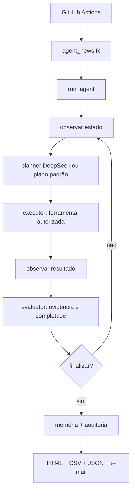

# Agent News

Agente autônomo em R para curadoria editorial de notícias reais, com coleta pública, validação de datas, deduplicação, ranking por IA (DeepSeek), resumo analítico em português do Brasil, envio por Gmail, memória persistente, planejamento por LLM, auditoria da execução e benchmark operacional.

## Visão Geral

O Agent News é um **radar semanal de inteligência informacional** que foi evoluído de um *pipeline* linear para um **agente autônomo** com ciclo *observar → planejar → executar → avaliar → memorizar*. Ele monitora automaticamente 15 fontes de notícias, seleciona as mais relevantes, gera resumos analíticos e envia um clipping por e-mail em HTML. Não é um agregador genérico de manchetes — prioriza fatos com impacto público real.



## Pipeline vs. Agente

O projeto preserva o pipeline determinístico original (coleta → deduplicação → ranking → seleção → resumo → HTML → envio) e o integra à nova arquitetura de agente. A diferença:

- **Pipeline (legado, preservado)**: sequência fixa de etapas executada por `run_news_agent()`. Continua disponível e funcional.
- **Agente (novo)**: `run_agent()` decide, a cada iteração, qual ferramenta executar, em que ordem e quando há evidência suficiente para finalizar. Sem chave DeepSeek (ou quando o planner falha), ele segue um **plano determinístico padrão** que reproduz exatamente o pipeline — portanto o comportamento funcional atual é preservado sempre que o agente não precisar decidir diferente.

## Por que este projeto existe?

A tomada de decisão em saúde pública, gestão, pesquisa e políticas públicas depende de informação atualizada, confiável e contextualizada. Este agente automatiza a curadoria semanal para:

- **Profissionais de saúde e gestores públicos**: acompanhar políticas do Cofen, Coren-RJ, Ministério da Saúde, MEC
- **Pesquisadores e acadêmicos**: monitorar editais, pesquisas e oportunidades de IFF e UENF
- **Jornalistas e analistas**: ter um panorama semanal de fatos relevantes com análise de impacto
- **Cidadãos do Norte Fluminense**: receber notícias locais de Campos dos Goytacazes e região

## Fontes de Notícias

| Fonte | Tipo de Coleta | Formato da Data | Observações |
|-------|---------------|-----------------|-------------|
| J3News | API REST WordPress | ISO 8601 (`date`) | Paginação com parada temporal |
| Folha1 | HTML Scraping | Metadados `DC.date.created` | charset ISO-8859-1 |
| IFF | HTML Scraping | Bloco `publicado` (DD/MM/AAAA HHhMM) | Portal institucional |
| UENF | Feed RSS + HTML | RSS `pubDate` | Complementado por páginas de notícias |
| BBC News | Feed RSS | RSS `pubDate` | 7 feeds temáticos oficiais |
| CNN Brasil | Sitemap XML + HTML | `article:published_time` | Sitemap Google News |
| Cofen | API REST WordPress | ISO 8601 (`date`) | Categoria notícias |
| MEC | HTML Scraping | `DC.date.created` ou URL | Portal gov.br (Plone) |
| Ministério da Saúde | HTML Scraping | `DC.date.created` ou URL | Portal gov.br (Plone) |
| Coren-RJ | Feed RSS + HTML Fallback | RSS `pubDate` | Fallback para scraping HTML |
| CNPq | Feed RSS/Atom | `pubDate`/`published` | Feed site-wide gov.br; seção de notícias é restrita |
| FAPERJ | HTML Scraping | `DD/MM/YYYY` (arquivo de notícias) | Fonte regional do Rio de Janeiro |
| CAPES | HTML Scraping + RSS | `effective` (JSON Volto) | Portal React/Volto; sujeito a defeso eleitoral/WAF |
| IBM | Feed RSS (newsroom + research) | RSS `pubDate` | Comunicados e pesquisa (não páginas de produto) |
| AHA | Feed RSS (newsroom) | RSS `pubDate` | Comunicados e notícias de pesquisa cardiovascular |

Cada fonte tem coletor independente. Falha em uma fonte é registrada e não impede as demais.

## Como Funciona (Fluxo de Dados)

### Passo 1: Acionamento
O agente é executado automaticamente pelo GitHub Actions (sábado às 07:00, Horário de Brasília) ou manualmente via `workflow_dispatch`. Também pode ser executado localmente.

### Passo 2: Loop do agente
`run_agent()` implementa o ciclo controlado:

1. carrega o objetivo;
2. carrega o estado (auditável) e a memória persistente;
3. observa o ambiente (resumo do estado atual);
4. envia o contexto relevante ao planner (DeepSeek) ou usa o plano determinístico padrão;
5. recebe e valida uma decisão estruturada (JSON);
6. executa somente a ferramenta autorizada (allowlist);
7. registra ação e resultado;
8. avalia o resultado (relevância, evidência, confiança, completude);
9. atualiza a memória;
10. decide se continua, corrige a estratégia ou finaliza;
11. respeita o limite de iterações (`AGENT_MAX_ITERATIONS`);
12. finaliza com relatório completo e auditável.

### Passo 3: Coleta
Cada fonte é acessada em paralelo seguro. O agente busca notícias dentro de uma janela de 30 dias, usando APIs REST, feeds RSS, sitemaps XML ou scraping HTML, dependendo da fonte.

### Passo 4: Deduplicação
- **Exata**: remove URLs duplicadas e títulos idênticos (normalizados)
- **Fuzzy**: remove notícias similares entre fontes diferentes (similaridade textual > 82%)
- **Entre execuções**: a memória persistente guarda URLs/hashes já processados, evitando reprocessamento — mas sempre preserva pelo menos 1 notícia por fonte coletada

### Passo 5: Ranqueamento por IA
O DeepSeek classifica cada notícia de 0 a 100, considerando:
- Relevância para saúde pública, ciência, políticas públicas
- Impacto regional (Campos dos Goytacazes, Norte Fluminense)
- Relevância acadêmica (para IFF e UENF)
- Penalização de fofoca, celebridades e clickbait
- **Exclusão rígida de política partidária e eleições** (nunca entram no clipping)

O filtro de assuntos bloqueia política/eleições (candidatos, partidos, campanhas, casas legislativas, urna/votação) de forma determinística, sem depender do LLM. "Política pública", "política de saúde" e "política educacional" continuam permitidas.

O ranking separa conceitualmente **relevance_score** e **evidence_score**. Sem chave DeepSeek, um ranking heurístico determinístico é usado.

### Passo 6: Seleção com Diversidade
O algoritmo garante que:
- Nenhuma fonte coletada fica vazia: cada fonte contribui com pelo menos 1 notícia, independentemente do score (o limiar editorial não pode esvaziar uma fonte);
- Cada fonte tenha pelo menos 5 notícias (NEWS_MIN_NEWS_PER_SOURCE), quando houver itens disponíveis e o teto global permitir;
- Máximo de 10 notícias por fonte (NEWS_PER_SOURCE);
- Total máximo de 50 notícias selecionadas (MAX_SELECTED_NEWS) — com 15 fontes, o teto global pode prevalecer sobre o mínimo por fonte;
- Score mínimo de 45 (NEWS_MIN_SCORE) para preencher vagas além do mínimo por fonte;
- Itens de política/eleições são bloqueados antes da seleção (nunca aparecem).

### Passo 7: Geração de Resumos
Para cada notícia selecionada, o DeepSeek (ou fallback determinístico) gera:
- Título editorial final
- Resumo do fato
- Análise de "Por que importa"
- Ressalvas e limitações (quando aplicável)

O resumo usa **somente** o conteúdo recuperado; nunca inventa fatos e sempre preserva fonte, URL, data, título e evidência utilizada.

### Passo 8: Montagem do E-mail
Renderização HTML responsiva, compatível com Gmail, com:
- Top 3 notícias em destaque
- Notícias agrupadas por fonte
- Links diretos para as fontes originais
- Status da coleta por fonte

### Passo 9: Envio e Auditoria
- Envio individual por destinatário via Gmail API (ou Outlook local)
- Respeita o modo de execução: `dry_run` (não envia), `test_mode` (envia só para o e-mail de teste) ou `normal_mode` (envia para a lista completa)
- Geração de artefatos: HTML, CSV, JSON de auditoria, relatório de run e auditoria do agente

## Arquitetura

```
agent-news/
├── agent_news.R              # Entrada principal (run_agent)
├── .Renviron.example         # Template de variáveis de ambiente
├── renv.lock                 # Dependências travadas
├── R/
│   ├── agent/                # Camada do agente
│   │   ├── agent.R           # run_agent(): loop observe→plan→act→evaluate
│   │   ├── state.R           # Estado auditável do agente
│   │   ├── planner.R         # Planner (DeepSeek) + plano determinístico padrão
│   │   ├── executor.R        # Registry de ferramentas + validação + execução
│   │   ├── evaluator.R       # Avaliação de evidência/confiança/completude
│   │   └── memory.R          # Memória persistente (JSON)
│   ├── tools/                # Ferramentas autorizadas (allowlist)
│   │   ├── tool_collect.R    # collect_news
│   │   ├── tool_search.R     # search_news
│   │   ├── tool_fetch.R      # fetch_article
│   │   ├── tool_deduplicate.R# deduplicate_news
│   │   ├── tool_rank.R       # rank_news
│   │   ├── tool_verify.R     # verify_source
│   │   ├── tool_summarize.R  # summarize_article
│   │   └── tool_send.R       # generate_report / send_report
│   ├── llm/                  # Camada LLM (planner)
│   │   ├── client.R          # Cliente fino sobre o DeepSeek
│   │   ├── prompts.R         # Prompts do planner
│   │   └── structured_output.R # JSON estruturado + recuperação
│   ├── config.R              # Configuração e variáveis de ambiente
│   ├── cli.R                 # Argumentos de linha de comando
│   ├── http.R                # HTTP, charset, parsing de datas, hash
│   ├── logging.R             # Logs estruturados
│   ├── collect_j3.R          # Coletor: J3News (API WordPress)
│   ├── collect_folha1.R      # Coletor: Folha1 (HTML)
│   ├── collect_iff.R         # Coletor: IFF (HTML)
│   ├── collect_uenf.R        # Coletor: UENF (RSS + HTML)
│   ├── collect_bbc.R         # Coletor: BBC News (RSS)
│   ├── collect_cnn.R         # Coletor: CNN Brasil (Sitemap + HTML)
│   ├── collect_cofen.R       # Coletor: Cofen (API WordPress)
│   ├── collect_mec.R         # Coletor: MEC (HTML)
│   ├── collect_saude.R       # Coletor: Ministério da Saúde (HTML)
│   ├── collect_coren.R       # Coletor: Coren-RJ (RSS + HTML)
│   ├── collect_cnpq.R        # Coletor: CNPq (RSS/Atom + HTML)
│   ├── collect_faperj.R      # Coletor: FAPERJ (HTML)
│   ├── collect_capes.R       # Coletor: CAPES (HTML + RSS)
│   ├── collect_ibm.R         # Coletor: IBM (RSS + HTML)
│   ├── collect_aha.R         # Coletor: AHA (RSS + HTML)
│   ├── collect_helpers.R     # Funções auxiliares de coleta
│   ├── deduplicate.R         # Normalização e deduplicação
│   ├── openai.R              # Cliente DeepSeek API
│   ├── rank.R                # Ranqueamento e seleção
│   ├── summarize.R           # Geração de resumos
│   ├── render_email.R        # Renderização HTML
│   ├── send_email.R          # Envio por Gmail/Outlook
│   ├── audit.R               # Auditoria (CSV/JSON)
│   ├── validate.R            # Validação de invariantes
│   └── pipeline.R            # Pipeline legado (run_news_agent)
├── scripts/
│   ├── setup_gmail_automated.R   # Configuração do Gmail
│   ├── validate_no_secrets.R     # Validação de segurança
│   ├── benchmark_agent.R         # Benchmark
│   └── send_outlook.ps1          # Envio via Outlook
├── tests/
│   └── testthat/             # Testes unitários e do agente
├── secrets/
│   └── .gitkeep              # Pasta de tokens (git-ignored)
├── outputs/
│   └── .gitkeep              # Artefatos gerados
└── .github/workflows/
    └── weekly-news.yml       # Workflow agendado
```

## Ferramentas (allowlist)

O executor aceita **somente** as ferramentas registradas no registry. O LLM (planner) nunca recebe código R e não pode executar comandos arbitrários, acessar secrets, alterar arquivos ou definir destinatários de e-mail. Cada ferramenta tem nome, descrição, argumentos validados, função de execução e resultado estruturado.

| Ferramenta | Descrição | Argumentos principais |
|-----------|-----------|----------------------|
| `collect_news` | Coleta das fontes configuradas | `sources`, `force` |
| `search_news` | Busca determinística nos itens coletados | `query`, `source` |
| `fetch_article` | Baixa o texto completo de um artigo | `id`, `url` |
| `deduplicate_news` | Deduplicação exata + memória | `use_memory` |
| `rank_news` | Ranking + seleção com diversidade | — |
| `verify_source` | Verifica alcançabilidade e domínio da fonte | `url`, `source`, `claim` |
| `summarize_article` | Gera resumos analíticos | `ids` |
| `generate_report` | Renderiza HTML + auditoria CSV/JSON | — |
| `send_report` | Envia o relatório (modo controlado) | — (nunca destinatários) |

## Planner (DeepSeek)

O DeepSeek atua como **planejador e tomador de decisão**. Ele recebe: objetivo, estado atual, observações, histórico resumido e as ferramentas disponíveis. Devolve uma decisão estruturada em JSON:

```json
{
  "action": "verify_source",
  "arguments": { "url": "https://..." },
  "reasoning_summary": "Fonte com relevância alta e evidência baixa.",
  "expected_result": "Confirmação de alcançabilidade e domínio.",
  "done": false
}
```

Regras de robustez:
- JSON inválido → recuperação segura →, se necessário, nova tentativa estruturada;
- decisão com ferramenta desconhecida ou argumentos inválidos → erro registrado e fallback para o plano determinístico;
- nunca é exposto chain-of-thought em logs/relatórios — apenas justificativas operacionais resumidas.

## Evaluator

A camada de avaliação é independente do planner. O agente **não** assume sucesso só porque uma função retornou sem erro. O evaluator verifica:

- se a ação produziu resultado útil;
- relevância (score médio dos itens ranqueados);
- qualidade da evidência (`none`, `standard`, `partial`, `high`);
- confiança (0–1);
- lacunas (fontes falhas, itens não verificados);
- completude (objetivo alcançado) e necessidade de continuar/interromper.

Uma notícia relevante baseada em fonte fraca não é tratada como equivalente a uma informação confirmada por fonte primária — o agente pode decidir buscar evidência adicional (`verify_source`, `fetch_article`).

## Natureza agentiva e perspectiva experimental

O `agent-news` é **agente** no sentido operacional, não apenas por nomenclatura: a cada iteração ele observa o estado, escolhe UMA ação da allowlist, executa, observa o resultado, avalia e decide a próxima ação com base no que observou. A sequência é:

```
OBSERVE → PLAN → ACT → OBSERVE RESULT → EVALUATE → REPLAN → ACT → ... → STOP
```

- **Adaptação real**: o resultado observado muda a avaliação (`insufficient`, `conflict_detected`, `needs_more_evidence`, `produced_new_info`), e a avaliação muda a próxima ação. Dois estados diferentes produzem trajetórias diferentes.
- **Replanejamento**: quando a coleta é insuficiente, o agente tenta re-coletar, depois buscar, depois verificar, e só então finaliza com insuficiência — nunca finge que o objetivo foi atingido.
- **Abandono de estratégia**: uma busca vazia é abandonada em favor de outra ação; o agente não repete a mesma ação indefinidamente.
- **Condições de parada**: limite de iterações (`AGENT_MAX_ITERATIONS`), detecção de loop improdutivo (`AGENT_MAX_REPEATED_ACTION`), insuficiência explícita e objetivo atingido.
- **Fallback determinístico**: sem DeepSeek (ou quando o planner falha), o agente segue o `adaptive_plan` determinístico — reativo ao evaluator, mas com regras fixas. Ele preserva o comportamento do pipeline e é a reserva de recuperação.

### O que é fallback determinístico vs. agente LLM

- **Agente LLM**: `planner.R` consulta o DeepSeek (quando há chave e orçamento) para escolher a próxima ação entre as ferramentas permitidas, com argumentos validados.
- **Fallback determinístico**: `adaptive_plan()` aplica regras fixas baseadas no resultado do `evaluator` — sem rede e sem LLM. É o comportamento padrão sem chave.

Ambos passam pelo mesmo executor (allowlist estrita) e pelo mesmo evaluator. O LLM **nunca** executa código R arbitrário: só escolhe o nome de uma ferramenta registrada e argumentos estruturados, que são validados antes de qualquer execução.

### Como a autonomia é avaliada

A suíte `tests/agent_eval.R` (cenários determinísticos, sem internet e sem DeepSeek) verifica comportamento adaptativo, não apenas resultado final:

| Cenário | O que verifica |
|---------|----------------|
| A. Baixa evidência | reconhece insuficiência e re-coleta em vez de seguir para resumo |
| B. Fontes conflitantes | conflito dispara verificação antes do ranking |
| C. Falha de fonte | falhas parciais não quebram o run; falha total encerra explicitamente |
| D. Notícias duplicadas | redundância é removida e não tratada como evidência independente |
| E. Artigos insuficientes | não finge que o objetivo foi alcançado |
| F. Replanejamento | a 2ª ação depende do resultado insuficiente da 1ª |
| G. Condição de parada | para quando o objetivo é atingido; encerra explicitamente quando é inatingível |
| H. Abandono de estratégia | busca vazia é abandonada em favor de outra ação |
| Adaptação fundamental | dois estados diferentes produzem trajetórias diferentes |
| Proteção contra loop | ação repetida é detectada e o run termina de forma auditável |

A camada `R/agent/metrics.R` torna a autonomia mensurável (iterações, replanejamentos, verificações, falhas recuperadas, loops interrompidos, confiança final) e a trajetória completa fica auditável em `outputs/agent-run-<run_id>.json` (ações, argumentos, resultados, decisões e `stop_reason`).

### Perspectiva experimental

O `agent-news` pode ser usado não apenas como aplicação, mas como **infraestrutura experimental** para investigar autonomia computacional sob diferentes condições informacionais:

- abundância versus escassez de informação;
- evidência concordante versus conflitante;
- falha de fontes;
- resultados redundantes;
- objetivos alcançáveis versus inalcançáveis;
- necessidade de replanejamento.

E há uma questão científica interessante aqui: vocês já têm uma infraestrutura que permite estudar não apenas se o agente funciona, mas como a autonomia computacional se comporta sob diferentes condições de informação. Essa provavelmente é uma direção mais interessante do que simplesmente adicionar mais ferramentas.

### Limitações da autonomia (declaradas)

- O agente é **autônomo na execução**, mas **não aprende entre execuções**: a memória JSON persiste o que foi processado (para deduplicação e auditoria), não é aprendizado.
- O planner de qualidade depende do DeepSeek; sem chave, a decisão é o fallback determinístico (menos flexível, mas previsível).
- Não há avaliação semântica avançada de conteúdo além do que o ranking/resumo por IA fornecem; o evaluator usa sinais operacionais verificáveis.
- A autonomia é **parcial por projeto**: limitada à allowlist de ferramentas, sem acesso a código arbitrário, secrets ou destinatários não autorizados.


## Memória persistente

A memória é um arquivo JSON leve (sem dependência extra) em `outputs/agent-memory.json` (configurável via `AGENT_MEMORY_PATH`). Ela estrutura as tabelas:

- `articles`, `sources`, `events`, `claims`, `evidence`;
- `agent_runs`, `agent_actions`, `agent_decisions`.

Regra de higiene: armazena apenas identificadores, hashes, URLs, datas, metadados e resultados de auditoria — nunca o conteúdo integral das páginas. Execuções futuras sabem o que já foi processado (deduplicação entre execuções).

## Auditoria

Além do CSV/JSON de notícias e do relatório de run, cada execução grava `outputs/agent-run-<run_id>.json`, que permite responder depois:

- “O que o agente fez nesta execução?” → `actions` + `results`
- “Quais fontes consultou?” → `observations` + memória `sources`
- “Quais ações executou?” → `actions`
- “Por que buscou determinada fonte?” → `reasoning_summary` das decisões
- “Por que descartou determinado item?” → `discard_reason` no CSV de auditoria
- “Por que decidiu finalizar?” → `decisions` com `done: true`

Nenhuma informação secreta é registrada.

## Modos de execução e destinatários

Há **três modos explícitos e sem ambiguidade**:

| Modo | Comportamento | Destinatários efetivos |
|------|--------------|------------------------|
| `dry_run` | **NÃO envia** e-mail (apenas gera artefatos) | `character(0)` |
| `test_mode` | Envia, mas **somente** para o e-mail de teste | `c("ryandpaulosantos@gmail.com")` |
| `normal_mode` | Envia para **todos** os destinatários configurados | lista completa + `thaynafarias2007@gmail.com` |

Regras obrigatórias implementadas:

- `test_mode => recipients == c("ryandpaulosantos@gmail.com")` (garantia programática, com teste automatizado);
- `normal_mode => recipients == lista completa configurada em EMAIL_TO + thaynafarias2007@gmail.com`;
- `dry_run => nenhum envio`;
- o e-mail `thaynafarias2007@gmail.com` faz parte permanente da lista normal;
- o e-mail de teste é `ryandpaulosantos@gmail.com`;
- durante testes/desenvolvimento/validação, envie **somente** para `ryandpaulosantos@gmail.com` — nunca para a lista completa.

## Configuração

### Guia Rápido para Iniciantes

```bash
# 1. Clone o repositório
git clone https://github.com/santosry/agent-news.git
cd agent-news

# 2. Instale o R e as dependências
Rscript -e "install.packages('renv'); renv::restore()"

# 3. Configure as variáveis (copie e edite)
cp .Renviron.example .Renviron
# Edite .Renviron com suas chaves

# 4. Execute em modo de teste (sem enviar e-mail)
DRY_RUN=true Rscript agent_news.R

# 5. Execute para valer
DRY_RUN=false Rscript agent_news.R
```

### Configuração Local no Windows

Use o R instalado em:

```powershell
& "C:\Program Files\R\R-4.6.0\bin\Rscript.exe" --version
```

Restaure dependências travadas:

```powershell
& "C:\Program Files\R\R-4.6.0\bin\Rscript.exe" -e "install.packages('renv', repos='https://cloud.r-project.org'); renv::restore(prompt=FALSE)"
```

Se precisar reconstruir o ambiente sem `renv`, instale dependências manualmente:

```powershell
& "C:\Program Files\R\R-4.6.0\bin\Rscript.exe" -e "install.packages(c('dplyr','purrr','stringr','stringi','tibble','tidyr','lubridate','jsonlite','rvest','xml2','httr2','gmailr','glue','htmltools','openssl','yaml','testthat','withr'), repos='https://cloud.r-project.org')"
```

### Variáveis de ambiente do agente

| Variável | Padrão | Descrição |
|----------|--------|-----------|
| `AGENT_MODE` | `monitor` | Modo: `monitor`, `investigate` ou `digest` |
| `AGENT_TEST_MODE` | `false` | Se `true`, envia só para o e-mail de teste |
| `AGENT_MAX_ITERATIONS` | `12` | Limite de iterações do agente |
| `AGENT_MAX_LLM_CALLS` | `40` | Limite de chamadas ao LLM (planner) |
| `AGENT_TOOL_TIMEOUT_SECONDS` | `120` | Timeout por ferramenta |
| `AGENT_MEMORY_PATH` | `outputs/agent-memory.json` | Caminho da memória persistente |
| `DEEPSEEK_PLANNER_MODEL` | `deepseek-chat` | Modelo usado pelo planner |

Os demais parâmetros (`max_iterations`, `window_days`/`NEWS_LOOKBACK_DAYS`, `ranking_model`/`DEEPSEEK_RANK_MODEL`, `summary_model`/`DEEPSEEK_SUMMARY_MODEL`, `planner_model`, `timezone`/`NEWS_TZ`, `schedule`, `recipients`/`EMAIL_TO`, `dry_run`, `test_mode`) permanecem configuráveis por variável de ambiente, preservando a compatibilidade com as variáveis existentes.

## DeepSeek (IA para Ranking e Resumo)

O agente usa a API do DeepSeek para ranquear e resumir notícias.

Configure no `.Renviron`:

```text
DEEPSEEK_API_KEY=sua-chave-aqui
DEEPSEEK_RANK_MODEL=deepseek-chat
DEEPSEEK_SUMMARY_MODEL=deepseek-chat
DEEPSEEK_REASONING_EFFORT=low
```

**Modelos disponíveis:**
- `deepseek-chat`: modelo econômico, ideal para classificação e resumo
- `deepseek-reasoner`: modelo com raciocínio aprofundado (mais caro, mais lento)

**Sem chave DeepSeek**, o modo `DRY_RUN=true` usa ranking e resumo determinísticos para validar coleta, HTML e auditoria. Para executar sem DeepSeek em produção, defina `ALLOW_NO_DEEPSEEK=true`.

**Com `ALLOW_NO_DEEPSEEK=true`**, se a API do DeepSeek falhar (chave inválida, erro HTTP ou timeout), o agente cai automaticamente para o ranking/resumo heurístico em vez de interromper a execução — assim o clipping continua sendo produzido e enviado.

## Configuração do Envio de E-mail (Gmail)

### Pré-requisitos

1. Uma conta Google (Gmail) para envio
2. Acesso ao Google Cloud Console
3. R com os pacotes `gmailr` e `openssl` instalados

### Passo 1: Criar projeto no Google Cloud Console

1. Acesse [https://console.cloud.google.com](https://console.cloud.google.com)
2. Crie um novo projeto ou selecione um existente
3. Vá para **APIs & Services** > **Library**
4. Pesquise por **Gmail API** e clique em **Enable**
5. Vá para **APIs & Services** > **Credentials**
6. Clique em **Create Credentials** > **OAuth client ID**
7. Se solicitado, configure a tela de consentimento OAuth:
   - Escolha **External** (ou Internal se for Google Workspace)
   - Preencha nome do app e e-mails de contato
   - Adicione o escopo `https://www.googleapis.com/auth/gmail.send`
   - Adicione seu e-mail como **Test user**
8. Em **Application type**, escolha **Desktop application**
9. Dê um nome (ex: "Agent News Gmail")
10. Clique em **Create** e faça o download do JSON
11. Renomeie o arquivo para `oauth_client.json` e coloque na raiz do projeto

### Passo 2: Executar o script de configuração

```bash
# Configure o e-mail remetente
export EMAIL_FROM="seu.email@gmail.com"

# Gere uma chave forte para criptografia
Rscript -e "cat(paste(sample(c(letters, LETTERS, 0:9), 32, replace=TRUE), collapse=''), '\n')"

# Defina a chave
export GMAILR_KEY="sua_chave_gerada_acima"

# Execute o script de configuração
Rscript scripts/setup_gmail_automated.R
```

O script irá:
1. Verificar se `oauth_client.json` existe
2. Oferecer opções de autenticação (navegador ou terminal)
3. Solicitar autorização do Google
4. Salvar o token em `secrets/gmailr-token.rds`
5. Gerar token criptografado e codificado em base64
6. Exibir instruções para configurar os secrets do GitHub

### Passo 2b: Configuração em Servidor Headless

Em servidores sem interface gráfica (incluindo GitHub Codespaces sem porta forward):

```bash
export EMAIL_FROM="seu.email@gmail.com"
export GMAILR_KEY="sua_chave"
Rscript scripts/setup_gmail_automated.R
# Escolha opção 2 (out-of-band/device flow)
# Abra a URL exibida em QUALQUER navegador
# Autorize e copie o código de volta para o terminal
```

### Passo 3: Configurar GitHub Secrets

Após executar o script, configure os secrets no GitHub:

1. Acesse: `https://github.com/santosry/agent-news/settings/secrets/actions`
2. Crie os secrets:

| Nome do Secret | Valor |
|---------------|-------|
| `EMAIL_FROM` | Seu e-mail remetente (ex.: `seu.email@gmail.com`) |
| `EMAIL_TO` | Destinatários separados por vírgula |
| `GMAILR_KEY` | A chave de criptografia gerada |
| `GMAILR_TOKEN_ENC_B64` | Conteúdo de `secrets/token_base64.txt` |
| `GMAIL_OAUTH_B64` | Conteúdo de `secrets/oauth_client_b64.txt` (base64 do `oauth_client.json`) |
| `DEEPSEEK_API_KEY` | Sua chave da API DeepSeek (opcional) |

### Passo 4: Testar envio local

```bash
# Teste sem enviar (dry run)
DRY_RUN=true Rscript agent_news.R

# Teste com envio real
DRY_RUN=false EMAIL_FROM="seu.email@gmail.com" Rscript agent_news.R
```

### Solução de Problemas do Gmail

| Problema | Causa Provável | Solução |
|----------|---------------|---------|
| `invalid_grant` | Token expirado ou revogado | Execute `scripts/setup_gmail_automated.R` novamente |
| `access_denied` | App não verificado | Adicione seu e-mail como Test User no OAuth consent screen |
| `Error 403: Request had insufficient authentication scopes` | Escopo errado | Use `https://www.googleapis.com/auth/gmail.send` |
| Token não encontrado no Actions | Secrets não configurados | Verifique `GMAILR_KEY`, `GMAILR_TOKEN_ENC_B64` e `GMAIL_OAUTH_B64` nos secrets |
| `GMAILR_KEY is required` | Chave não definida | Configure a variável de ambiente ou GitHub Secret |
| `unknown input format` / `Failed to deserialize the Gmail token` | `GMAILR_KEY` não bate com a chave usada para criptografar o token | Regenere o token com `scripts/setup_gmail_automated.R` e atualize **ambos** os secrets `GMAILR_KEY` e `GMAILR_TOKEN_ENC_B64` |
| `GMAILR_TOKEN_ENC_B64 does not contain a valid encrypted Gmail token` | Secret preenchido com o base64 errado | Use exatamente o conteúdo de `secrets/token_base64.txt` (token **criptografado**, não o token simples) |
| App em "Testing" e token expira em 7 dias | Modo de teste do Google | Renove o token semanalmente ou solicite verificação do app |
| Navegador não abre (headless) | Sem interface gráfica | Use opção 2 (out-of-band flow) no script de setup |

> **Dica:** O Google revoga tokens de apps em modo "Testing" após 7 dias. Para uso contínuo, agende a renovação semanal do token ou solicite a verificação do app (pode levar semanas).

## Execução

Opções de linha de comando (sem quebrar os argumentos existentes):

```bash
Rscript agent_news.R            # usa DRY_RUN do ambiente (.Renviron)
Rscript agent_news.R --dry-run  # não envia e-mail
Rscript agent_news.R --send     # envia (dry_run = FALSE)
Rscript agent_news.R --test     # test_mode: envia só para ryandpaulosantos@gmail.com
Rscript agent_news.R --mode monitor|investigate|digest
```

### Dry Run (teste sem envio)

```powershell
# R
$env:DRY_RUN="true"
& "C:\Program Files\R\R-4.6.0\bin\Rscript.exe" agent_news.R --dry-run
```

```bash
# bash
DRY_RUN=true Rscript agent_news.R --dry-run
```

### Test Mode (envio somente para o e-mail de teste)

```bash
# Envia APENAS para ryandpaulosantos@gmail.com
AGENT_TEST_MODE=true DRY_RUN=false Rscript agent_news.R --send --test
```

> ⚠️ Nunca envie mensagens de teste para a lista completa. `test_mode` força
> `send_recipients == c("ryandpaulosantos@gmail.com")`.

### Envio Real

```powershell
$env:DRY_RUN="false"
& "C:\Program Files\R\R-4.6.0\bin\Rscript.exe" agent_news.R
```

```bash
DRY_RUN=false Rscript agent_news.R
```

### Envio sem DeepSeek (modo determinístico)

```powershell
$env:DRY_RUN="false"
$env:ALLOW_NO_DEEPSEEK="true"
Remove-Item Env:DEEPSEEK_API_KEY -ErrorAction SilentlyContinue
& "C:\Program Files\R\R-4.6.0\bin\Rscript.exe" agent_news.R
```

### Envio via Outlook Local (Windows)

```powershell
$env:DRY_RUN="false"
$env:ALLOW_NO_DEEPSEEK="true"
$env:EMAIL_TRANSPORT="outlook"
& "C:\Program Files\R\R-4.6.0\bin\Rscript.exe" agent_news.R
```

## GitHub Actions

O workflow está em `.github/workflows/weekly-news.yml`.

- **Agendamento**: sábado às 07:00 (Horário de Brasília = 10:00 UTC) — `cron: '0 10 * * 6'`
- **workflow_dispatch**: execução manual com parâmetros `dry_run` (boolean) e `test_mode` (boolean)
  - `dry_run=true` → gera artefatos sem enviar
  - `dry_run=false, test_mode=false` → execução normal (lista completa)
  - `dry_run=false, test_mode=true` → envia somente para `ryandpaulosantos@gmail.com`
- Restaura dependências travadas pelo `renv.lock`
- Valida sintaxe R, workflow YAML, secrets e testes antes do agente
- Configura OAuth do Gmail automaticamente a partir dos secrets
- Publica artefatos (HTML, CSV, JSON) da execução

O agendamento é sempre `normal_mode` (envia para a lista completa). Execuções manuais usam `test_mode`/`dry_run` conforme o parâmetro — um teste nunca é interpretado como execução normal.

### Secrets Necessários no GitHub

| Secret | Obrigatório | Descrição |
|--------|------------|-----------|
| `EMAIL_FROM` | Para envio real | Remetente do e-mail |
| `EMAIL_TO` | Para envio real | Destinatários separados por vírgula |
| `DEEPSEEK_API_KEY` | Recomendado | Chave da API DeepSeek para ranking e resumo |
| `GMAILR_KEY` | Para envio real | Chave de criptografia do token Gmail |
| `GMAILR_TOKEN_ENC_B64` | Para envio real | Token Gmail criptografado em base64 |
| `GMAIL_OAUTH_B64` | Para envio real | `oauth_client.json` em base64 (necessário para renovar o token) |

## Segurança

### Regras Obrigatórias

1. ❌ **Nunca** coloque chaves reais em arquivos do repositório
2. ❌ **Nunca** commite `oauth_client.json`
3. ❌ **Nunca** commite arquivos da pasta `secrets/`
4. ✅ Use `.Renviron.example` com placeholders
5. ✅ Mantenha `.Renviron` no `.gitignore`
6. ✅ Mantenha `secrets/` no `.gitignore`
7. ✅ Use GitHub Secrets para chaves em Actions
8. ✅ Execute `scripts/validate_no_secrets.R` antes de commitar

### Segurança do agente (LLM)

O DeepSeek atua apenas como planejador. Ele **não** pode:

- executar comandos do sistema ou código R arbitrário;
- acessar secrets diretamente;
- modificar arquivos;
- enviar e-mail para destinatários não autorizados (os destinatários são resolvidos pelo modo de execução, nunca pelo modelo);
- alterar configuração de segurança;
- ignorar limites de execução (`AGENT_MAX_ITERATIONS`, timeout por ferramenta, limite de chamadas ao LLM).

Não existe `eval(parse(text = resposta_do_llm))` em nenhum ponto do projeto.

### Verificação de Segurança

```bash
Rscript scripts/validate_no_secrets.R
```

Este script verifica:
- Arquivos proibidos rastreados (`.Renviron`, `oauth_client.json`, `secrets/*`)
- Padrões de chaves API (DeepSeek, OpenAI, Gmail)
- Tokens e secrets em arquivos versionados

## Testes

```powershell
& "C:\Program Files\R\R-4.6.0\bin\Rscript.exe" tests/testthat.R
& "C:\Program Files\R\R-4.6.0\bin\Rscript.exe" tests/agent_eval.R
```

Os testes cobrem: normalização, deduplicação, datas, janela de 7 dias, encoding, destinatários, top 3, falhas de fonte, renderização HTML, os coletores das cinco novas fontes (CNPq, FAPERJ, CAPES, IBM, AHA, via fixtures determinísticos), e — para o agente — registro de ferramentas, validação de ações, JSON inválido, ferramenta inexistente, limite de iterações, erro de ferramenta, recuperação de erro, memória, modos `dry_run`/`test_mode`/`normal_mode` e seleção correta dos destinatários. Eles **não enviam e-mail** e **não dependem de internet**.

A suíte de avaliação comportamental (`tests/agent_eval.R`) roda cenários controlados de autonomia (baixa evidência, conflito, falha, duplicação, insuficiência, replanejamento, condição de parada, abandono de estratégia e proteção contra loop), também sem internet e sem DeepSeek.

O teste de destinatários é crítico e garante programaticamente:

```r
test_mode  => send_recipients == c("ryandpaulosantos@gmail.com")
normal_mode => send_recipients == lista completa (inclui thaynafarias2007@gmail.com)
dry_run    => send_recipients == character(0)  (nenhum envio)
```

### Como verificar a auditoria

```bash
# Relatório do agente desta execução (ações, decisões, resultados, evidências)
cat outputs/agent-run-*.json

# Auditoria de notícias (score, tópico, seleção, motivo de descarte)
cat outputs/news-audit-*.csv

# Relatório de run (modo, destinatários, envio, status das fontes)
cat outputs/news-run-report-*.json

# Memória persistente (tabelas estruturadas)
cat outputs/agent-memory.json
```

## Benchmark

```powershell
$env:DRY_RUN="true"
& "C:\Program Files\R\R-4.6.0\bin\Rscript.exe" scripts/benchmark_agent.R
```

Mede coleta, deduplicação, ranking heurístico, seleção, resumo dry run e renderização das 15 fontes configuradas (a lista é detectada automaticamente a partir de `news_collectors()`), sem enviar e-mail e sem chamar a API DeepSeek.

## Artifacts e Auditoria

A cada execução são gerados em `outputs/`:

- `weekly-news-*.html` — E-mail renderizado
- `news-audit-*.csv` — Metadados e scores de todas as notícias
- `news-audit-*.json` — Versão JSON da auditoria
- `news-run-report-*.json` — Relatório completo da execução
- `benchmark-*.csv` / `benchmark-*.json` — Resultados do benchmark

## FAQ

### Por que minha notícia não foi selecionada?

A seleção segue critérios editoriais rigorosos:
- **Fora da janela**: apenas notícias dos últimos 30 dias
- **Score baixo**: o DeepSeek atribui score de 0-100; o corte padrão é 45
- **Penalização**: fofoca, celebridades, esportes rotineiros e clickbait são penalizados
- **Limite por fonte**: máximo de 10 notícias por fonte
- **Data não validada**: se a data de publicação não pôde ser extraída, a notícia é descartada

### Como ajustar a relevância das notícias?

Edite as variáveis no `.Renviron`:

```text
NEWS_MIN_SCORE=45          # Score mínimo para preencher além do mínimo por fonte (padrão: 45)
NEWS_SOURCE_MIN_SCORE=30   # Reservado (não usado na seleção atual)
NEWS_MIN_NEWS_PER_SOURCE=5 # Mínimo garantido por fonte
NEWS_PER_SOURCE=10         # Máximo de notícias por fonte
MAX_SELECTED_NEWS=50       # Total máximo de notícias no clipping
NEWS_LOOKBACK_DAYS=30      # Janela temporal em dias
```

Para ajustar os critérios de ranqueamento, edite as instruções em `R/rank.R` (função `rank_news`).

### O que fazer se uma fonte parar de funcionar?

1. **Verifique o log**: o status da fonte aparece no console e no relatório JSON
2. **Teste a URL manualmente**: acesse a URL da fonte no navegador
3. **Sites gov.br**: podem exigir User-Agent específico ou estar sob WAF
4. **Feeds RSS**: podem mudar de URL; verifique o site oficial
5. **Estrutura HTML**: sites podem alterar classes CSS e estrutura
6. **Abra uma issue**: reporte no GitHub para atualização do coletor

- **Fallback automático**: RSS/API → HTML em todas as fontes. Se tudo falhar, a fonte é registrada como `failed` sem quebrar as demais

### O token do Gmail expirou. O que fazer?

Execute `scripts/setup_gmail_automated.R` novamente para gerar um novo token. Atualize o secret `GMAILR_TOKEN_ENC_B64` no GitHub.

### Posso usar o agente sem a API DeepSeek?

Sim! Defina `ALLOW_NO_DEEPSEEK=true`. O agente usará um algoritmo heurístico para ranquear e resumir notícias. A qualidade é inferior, mas é funcional.

### Como adicionar uma nova fonte?

1. Estude um coletor existente (ex: `R/collect_coren.R`)
2. Crie `R/collect_novafonte.R` seguindo o mesmo padrão
3. Adicione a função em `R/pipeline.R` na lista `news_collectors()`
4. Adicione o nome em `R/config.R` na função `source_order()`
5. Atualize o README com a nova fonte

## Solução de Problemas

### Problemas por Fonte

| Fonte | Problema Comum | Solução |
|-------|---------------|---------|
| J3News | API fora do ar | Verifique `https://j3news.com/wp-json/wp/v2/posts` |
| Folha1 | Acentos quebrados | O coletor converte de ISO-8859-1; verifique charset HTTP |
| IFF | Sem itens | Verifique `tileItem` e formato de data |
| UENF | Feed RSS vazio | Verifique `https://uenf.br/portal/categoria/noticias/feed/` |
| BBC News | Feed inacessível | BBC pode bloquear IPs de datacenters |
| CNN Brasil | Sitemap vazio | Reduza/aumente `CNN_MAX_PUBLIC_PAGES` |
| Cofen | API bloqueada | WAF pode exigir User-Agent; tente com browser |
| MEC | Página 403 | gov.br pode bloquear IPs; o coletor registra a falha |
| Ministério da Saúde | Página 403 | Mesmo caso do MEC; tente URL alternativa `/noticias` |
| Coren-RJ | Feed vazio | Fallback automático para scraping HTML |

### Problemas Gerais

- **E-mail não chega**: verifique spam, confirme secrets do GitHub Actions
- **DeepSeek retorna erro**: verifique saldo/créditos em [platform.deepseek.com](https://platform.deepseek.com)
- **Pacotes R ausentes**: execute `renv::restore()` ou instale manualmente
- **Workflow do GitHub falha**: verifique a aba Actions para logs detalhados

## Limitações

- A autonomia do agente é **limitada**: ele só pode executar ferramentas registradas na allowlist, nunca código arbitrário, comandos de sistema, acesso a secrets ou envio para destinatários não autorizados. Ele não tem "autonomia total".
- Sem chave DeepSeek (ou quando o planner falha), o agente segue o plano determinístico padrão (qualidade inferior ao ranking/resumo por IA, mas funcional).
- O agente usa apenas conteúdo público e não contorna paywalls, login ou bloqueios
- Sites podem alterar estrutura, feeds, charset ou políticas de robots a qualquer momento
- gov.br (MEC, Saúde) pode bloquear IPs de datacenters (incluindo GitHub Actions); os coletores registram a falha e tentam URLs alternativas
- CNPq: a seção de notícias responde "Conteúdo Restrito" e o feed oficial é site-wide (inclui itens administrativos); o coletor filtra PDFs/títulos vazios e o ranking faz o filtro editorial restante
- CAPES: portal React/Volto com notícias sujeitas a "defeso eleitoral"; o WAF do gov.br pode bloquear IPs de datacenter e a página principal expõe poucas notícias por vez
- AHA: o portal de periódicos (ahajournals.org) é protegido contra bots (403); o coletor usa o newsroom oficial (comunicados e notícias de pesquisa)
- IBM: o feed de pesquisa (research.ibm.com/rss) exige header Accept adequado; prioriza-se conteúdo editorial (newsroom/research) em vez de páginas de produto
- Feeds e sitemaps podem não expor todo o histórico semanal quando o volume é alto
- O token Gmail em modo "Testing" expira após 7 dias
- O resumo depende do conteúdo público disponível no momento da execução

## Contribuindo

Contribuições são bem-vindas! Para adicionar uma nova fonte:

1. Crie o coletor em `R/collect_novafonte.R`
2. Registre em `R/pipeline.R` e `R/config.R`
3. Atualize o `renv.lock` se adicionar dependências
4. Teste com `DRY_RUN=true Rscript agent_news.R`
5. Execute `Rscript scripts/validate_no_secrets.R`
6. Atualize o README
7. Envie um Pull Request

## Licença

Este projeto é distribuído sob licença MIT. Consulte o arquivo LICENSE para detalhes.
