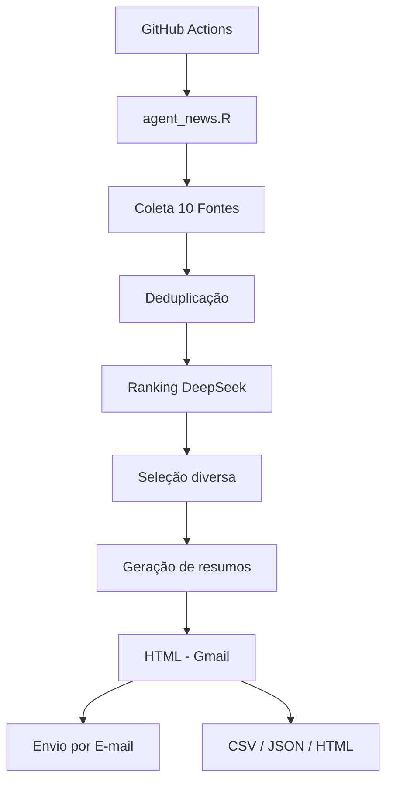

# Agent News

Agente semanal em R para curadoria editorial de notícias reais, com coleta pública, validação de datas, deduplicação, ranking por IA (DeepSeek), resumo analítico em português do Brasil, envio por Gmail, auditoria da execução e benchmark operacional.

## Visão Geral

O Agent News é um **radar semanal de inteligência informacional**. Ele monitora automaticamente 10 fontes de notícias, seleciona as mais relevantes usando IA (DeepSeek), gera resumos analíticos e envia um clipping por e-mail em HTML. Não é um agregador genérico de manchetes — ele prioriza fatos com impacto público real.



## Por que este projeto existe?

A tomada de decisão em saúde pública, gestão, pesquisa e políticas públicas depende de informação atualizada, confiável e contextualizada. Este agente automatiza a curadoria semanal para:

- **Profissionais de saúde e gestores públicos**: acompanhar políticas do Cofen, Coren-RJ, Ministério da Saúde, MEC
- **Pesquisadores e acadêmicos**: monitorar editais, pesquisas e oportunidades de IFF e UENF
- **Jornalistas e analistas**: ter um panorama semanal de fatos relevantes com análise de impacto
- **Cidadãos do Norte Fluminense**: receber notícias locais de Campos dos Goytacazes e região

## Fontes de Notícias

| Fonte | Tipo de Coleta | Formato da Data | Observações |
|-------|---------------|-----------------|-------------|
| J3News | API REST WordPress | ISO 8601 (`date`) | Paginação com parada temporal |
| Folha1 | HTML Scraping | Metadados `DC.date.created` | charset ISO-8859-1 |
| IFF | HTML Scraping | Bloco `publicado` (DD/MM/AAAA HHhMM) | Portal institucional |
| UENF | Feed RSS + HTML | RSS `pubDate` | Complementado por páginas de notícias |
| BBC News | Feed RSS | RSS `pubDate` | 7 feeds temáticos oficiais |
| CNN Brasil | Sitemap XML + HTML | `article:published_time` | Sitemap Google News |
| Cofen | API REST WordPress | ISO 8601 (`date`) | Categoria notícias |
| MEC | HTML Scraping | `DC.date.created` ou URL | Portal gov.br (Plone) |
| Ministério da Saúde | HTML Scraping | `DC.date.created` ou URL | Portal gov.br (Plone) |
| Coren-RJ | Feed RSS + HTML Fallback | RSS `pubDate` | Fallback para scraping HTML |

Cada fonte tem coletor independente. Falha em uma fonte é registrada e não impede as demais.

## Como Funciona (Fluxo de Dados)

### Passo 1: Acionamento
O agente é executado automaticamente pelo GitHub Actions (sábado às 07:00 e quarta às 07:00, Horário de Brasília) ou manualmente via `workflow_dispatch`. Também pode ser executado localmente.

### Passo 2: Coleta
Cada fonte é acessada em paralelo seguro. O agente busca notícias dentro de uma janela de 30 dias, usando APIs REST, feeds RSS, sitemaps XML ou scraping HTML, dependendo da fonte.

### Passo 3: Deduplicação
- **Exata**: remove URLs duplicadas e títulos idênticos (normalizados)
- **Fuzzy**: remove notícias similares entre fontes diferentes (similaridade textual > 82%)

### Passo 4: Ranqueamento por IA
O DeepSeek classifica cada notícia de 0 a 100, considerando:
- Relevância para saúde pública, ciência, políticas públicas
- Impacto regional (Campos dos Goytacazes, Norte Fluminense)
- Relevância acadêmica (para IFF e UENF)
- Penalização de fofoca, celebridades e clickbait

### Passo 5: Seleção com Diversidade
O algoritmo garante que:
- Cada fonte tenha pelo menos 5 notícias (NEWS_MIN_NEWS_PER_SOURCE)
- Máximo de 10 notícias por fonte
- Total máximo de 50 notícias selecionadas
- Score mínimo de 45 para preencher vagas além do mínimo por fonte

### Passo 6: Geração de Resumos
Para cada notícia selecionada, o DeepSeek gera:
- Título editorial final
- Resumo do fato
- Análise de "Por que importa"
- Ressalvas e limitações (quando aplicável)

### Passo 7: Montagem do E-mail
Renderização HTML responsiva, compatível com Gmail, com:
- Top 3 notícias em destaque
- Notícias agrupadas por fonte
- Links diretos para as fontes originais
- Nota metodológica

### Passo 8: Envio e Auditoria
- Envio individual por destinatário via Gmail API
- Geração de artefatos: HTML, CSV, JSON de auditoria
- Relatório completo da execução

## Arquitetura

```
agent-news/
├── agent_news.R              # Entrada principal
├── .Renviron.example         # Template de variáveis de ambiente
├── renv.lock                 # Dependências travadas
├── R/
│   ├── config.R              # Configuração e variáveis de ambiente
│   ├── http.R                # HTTP, charset, parsing de datas
│   ├── logging.R             # Logs estruturados
│   ├── collect_j3.R          # Coletor: J3News (API WordPress)
│   ├── collect_folha1.R      # Coletor: Folha1 (HTML)
│   ├── collect_iff.R         # Coletor: IFF (HTML)
│   ├── collect_uenf.R        # Coletor: UENF (RSS + HTML)
│   ├── collect_bbc.R         # Coletor: BBC News (RSS)
│   ├── collect_cnn.R         # Coletor: CNN Brasil (Sitemap + HTML)
│   ├── collect_cofen.R       # Coletor: Cofen (API WordPress)
│   ├── collect_mec.R         # Coletor: MEC (HTML)
│   ├── collect_saude.R       # Coletor: Ministério da Saúde (HTML)
│   ├── collect_coren.R       # Coletor: Coren-RJ (RSS + HTML)
│   ├── collect_helpers.R     # Funções auxiliares de coleta
│   ├── deduplicate.R         # Normalização e deduplicação
│   ├── openai.R              # Cliente DeepSeek API
│   ├── rank.R                # Ranqueamento e seleção
│   ├── summarize.R           # Geração de resumos
│   ├── render_email.R        # Renderização HTML
│   ├── send_email.R          # Envio por Gmail/Outlook
│   ├── audit.R               # Auditoria (CSV/JSON)
│   ├── validate.R            # Validação de invariantes
│   └── pipeline.R            # Orquestração do pipeline
├── scripts/
│   ├── setup_gmail_automated.R   # Configuração do Gmail
│   ├── validate_no_secrets.R     # Validação de segurança
│   ├── benchmark_agent.R         # Benchmark
│   └── send_outlook.ps1          # Envio via Outlook
├── tests/
│   └── testthat/             # Testes unitários
├── secrets/
│   └── .gitkeep              # Pasta de tokens (git-ignored)
├── outputs/
│   └── .gitkeep              # Artefatos gerados
└── .github/workflows/
    └── weekly-news.yml       # Workflow agendado
```

## Configuração

### Guia Rápido para Iniciantes

```bash
# 1. Clone o repositório
git clone https://github.com/santosry/agent-news.git
cd agent-news

# 2. Instale o R e as dependências
Rscript -e "install.packages('renv'); renv::restore()"

# 3. Configure as variáveis (copie e edite)
cp .Renviron.example .Renviron
# Edite .Renviron com suas chaves

# 4. Execute em modo de teste (sem enviar e-mail)
DRY_RUN=true Rscript agent_news.R

# 5. Execute para valer
DRY_RUN=false Rscript agent_news.R
```

### Configuração Local no Windows

Use o R instalado em:

```powershell
& "C:\Program Files\R\R-4.6.0\bin\Rscript.exe" --version
```

Restaure dependências travadas:

```powershell
& "C:\Program Files\R\R-4.6.0\bin\Rscript.exe" -e "install.packages('renv', repos='https://cloud.r-project.org'); renv::restore(prompt=FALSE)"
```

Se precisar reconstruir o ambiente sem `renv`, instale dependências manualmente:

```powershell
& "C:\Program Files\R\R-4.6.0\bin\Rscript.exe" -e "install.packages(c('dplyr','purrr','stringr','stringi','tibble','tidyr','lubridate','jsonlite','rvest','xml2','httr2','gmailr','glue','htmltools','openssl','yaml','testthat','withr'), repos='https://cloud.r-project.org')"
```

## DeepSeek (IA para Ranking e Resumo)

O agente usa a API do DeepSeek para ranquear e resumir notícias.

Configure no `.Renviron`:

```text
DEEPSEEK_API_KEY=sua-chave-aqui
DEEPSEEK_RANK_MODEL=deepseek-chat
DEEPSEEK_SUMMARY_MODEL=deepseek-chat
DEEPSEEK_REASONING_EFFORT=low
```

**Modelos disponíveis:**
- `deepseek-chat`: modelo econômico, ideal para classificação e resumo
- `deepseek-reasoner`: modelo com raciocínio aprofundado (mais caro, mais lento)

**Sem chave DeepSeek**, o modo `DRY_RUN=true` usa ranking e resumo determinísticos para validar coleta, HTML e auditoria. Para executar sem DeepSeek em produção, defina `ALLOW_NO_DEEPSEEK=true`.

## Configuração do Envio de E-mail (Gmail)

### Pré-requisitos

1. Uma conta Google (Gmail) para envio
2. Acesso ao Google Cloud Console
3. R com os pacotes `gmailr` e `openssl` instalados

### Passo 1: Criar projeto no Google Cloud Console

1. Acesse [https://console.cloud.google.com](https://console.cloud.google.com)
2. Crie um novo projeto ou selecione um existente
3. Vá para **APIs & Services** > **Library**
4. Pesquise por **Gmail API** e clique em **Enable**
5. Vá para **APIs & Services** > **Credentials**
6. Clique em **Create Credentials** > **OAuth client ID**
7. Se solicitado, configure a tela de consentimento OAuth:
   - Escolha **External** (ou Internal se for Google Workspace)
   - Preencha nome do app e e-mails de contato
   - Adicione o escopo `https://www.googleapis.com/auth/gmail.send`
   - Adicione seu e-mail como **Test user**
8. Em **Application type**, escolha **Desktop application**
9. Dê um nome (ex: "Agent News Gmail")
10. Clique em **Create** e faça o download do JSON
11. Renomeie o arquivo para `oauth_client.json` e coloque na raiz do projeto

### Passo 2: Executar o script de configuração

```bash
# Configure o e-mail remetente
export EMAIL_FROM="seu.email@gmail.com"

# Gere uma chave forte para criptografia
Rscript -e "cat(paste(sample(c(letters, LETTERS, 0:9), 32, replace=TRUE), collapse=''), '\n')"

# Defina a chave
export GMAILR_KEY="sua_chave_gerada_acima"

# Execute o script de configuração
Rscript scripts/setup_gmail_automated.R
```

O script irá:
1. Verificar se `oauth_client.json` existe
2. Oferecer opções de autenticação (navegador ou terminal)
3. Solicitar autorização do Google
4. Salvar o token em `secrets/gmailr-token.rds`
5. Gerar token criptografado e codificado em base64
6. Exibir instruções para configurar os secrets do GitHub

### Passo 2b: Configuração em Servidor Headless

Em servidores sem interface gráfica (incluindo GitHub Codespaces sem porta forward):

```bash
export EMAIL_FROM="seu.email@gmail.com"
export GMAILR_KEY="sua_chave"
Rscript scripts/setup_gmail_automated.R
# Escolha opção 2 (out-of-band/device flow)
# Abra a URL exibida em QUALQUER navegador
# Autorize e copie o código de volta para o terminal
```

### Passo 3: Configurar GitHub Secrets

Após executar o script, configure os secrets no GitHub:

1. Acesse: `https://github.com/santosry/agent-news/settings/secrets/actions`
2. Crie os secrets:

| Nome do Secret | Valor |
|---------------|-------|
| `GMAILR_KEY` | A chave de criptografia gerada |
| `GMAILR_TOKEN_ENC_B64` | Conteúdo de `secrets/token_base64.txt` |
| `GMAIL_OAUTH_B64` | Conteúdo de `secrets/oauth_client_b64.txt` (base64 do `oauth_client.json`) |
| `DEEPSEEK_API_KEY` | Sua chave da API DeepSeek |

### Passo 4: Testar envio local

```bash
# Teste sem enviar (dry run)
DRY_RUN=true Rscript agent_news.R

# Teste com envio real
DRY_RUN=false EMAIL_FROM="seu.email@gmail.com" Rscript agent_news.R
```

### Solução de Problemas do Gmail

| Problema | Causa Provável | Solução |
|----------|---------------|---------|
| `invalid_grant` | Token expirado ou revogado | Execute `scripts/setup_gmail_automated.R` novamente |
| `access_denied` | App não verificado | Adicione seu e-mail como Test User no OAuth consent screen |
| `Error 403: Request had insufficient authentication scopes` | Escopo errado | Use `https://www.googleapis.com/auth/gmail.send` |
| Token não encontrado no Actions | Secrets não configurados | Verifique `GMAILR_KEY`, `GMAILR_TOKEN_ENC_B64` e `GMAIL_OAUTH_B64` nos secrets |
| `GMAILR_KEY is required` | Chave não definida | Configure a variável de ambiente ou GitHub Secret |
| App em "Testing" e token expira em 7 dias | Modo de teste do Google | Renove o token semanalmente ou solicite verificação do app |
| Navegador não abre (headless) | Sem interface gráfica | Use opção 2 (out-of-band flow) no script de setup |

> **Dica:** O Google revoga tokens de apps em modo "Testing" após 7 dias. Para uso contínuo, agende a renovação semanal do token ou solicite a verificação do app (pode levar semanas).

## Execução

### Dry Run (teste sem envio)

```powershell
# R
$env:DRY_RUN="true"
& "C:\Program Files\R\R-4.6.0\bin\Rscript.exe" agent_news.R
```

```bash
# bash
DRY_RUN=true Rscript agent_news.R
```

### Envio Real

```powershell
$env:DRY_RUN="false"
& "C:\Program Files\R\R-4.6.0\bin\Rscript.exe" agent_news.R
```

```bash
DRY_RUN=false Rscript agent_news.R
```

### Envio sem DeepSeek (modo determinístico)

```powershell
$env:DRY_RUN="false"
$env:ALLOW_NO_DEEPSEEK="true"
Remove-Item Env:DEEPSEEK_API_KEY -ErrorAction SilentlyContinue
& "C:\Program Files\R\R-4.6.0\bin\Rscript.exe" agent_news.R
```

### Envio via Outlook Local (Windows)

```powershell
$env:DRY_RUN="false"
$env:ALLOW_NO_DEEPSEEK="true"
$env:EMAIL_TRANSPORT="outlook"
& "C:\Program Files\R\R-4.6.0\bin\Rscript.exe" agent_news.R
```

## GitHub Actions

O workflow está em `.github/workflows/weekly-news.yml`.

- **Agendamento**: sábado às 07:00 (Horário de Brasília = 10:00 UTC) e quarta-feira às 07:00 (10:00 UTC)
- **workflow_dispatch**: execução manual com opção `dry_run`
- Restaura dependências travadas pelo `renv.lock`
- Valida sintaxe R, workflow YAML, secrets e testes antes do agente
- Configura OAuth do Gmail automaticamente a partir dos secrets
- Publica artefatos (HTML, CSV, JSON) da execução

### Secrets Necessários no GitHub

| Secret | Obrigatório | Descrição |
|--------|------------|-----------|
| `DEEPSEEK_API_KEY` | Recomendado | Chave da API DeepSeek para ranking e resumo |
| `GMAILR_KEY` | Para envio real | Chave de criptografia do token Gmail |
| `GMAILR_TOKEN_ENC_B64` | Para envio real | Token Gmail criptografado em base64 |
| `GMAIL_OAUTH_B64` | Para envio real | `oauth_client.json` em base64 (necessário para renovar o token) |

## Segurança

### Regras Obrigatórias

1. ❌ **Nunca** coloque chaves reais em arquivos do repositório
2. ❌ **Nunca** commite `oauth_client.json`
3. ❌ **Nunca** commite arquivos da pasta `secrets/`
4. ✅ Use `.Renviron.example` com placeholders
5. ✅ Mantenha `.Renviron` no `.gitignore`
6. ✅ Mantenha `secrets/` no `.gitignore`
7. ✅ Use GitHub Secrets para chaves em Actions
8. ✅ Execute `scripts/validate_no_secrets.R` antes de commitar

### Verificação de Segurança

```bash
Rscript scripts/validate_no_secrets.R
```

Este script verifica:
- Arquivos proibidos rastreados (`.Renviron`, `oauth_client.json`, `secrets/*`)
- Padrões de chaves API (DeepSeek, OpenAI, Gmail)
- Tokens e secrets em arquivos versionados

## Testes

```powershell
& "C:\Program Files\R\R-4.6.0\bin\Rscript.exe" tests/testthat.R
```

Os testes cobrem: normalização, deduplicação, datas, janela de 7 dias, encoding, destinatários, top 3, falhas de fonte e renderização HTML. Eles não enviam e-mail.

## Benchmark

```powershell
$env:DRY_RUN="true"
& "C:\Program Files\R\R-4.6.0\bin\Rscript.exe" scripts/benchmark_agent.R
```

Mede coleta, deduplicação, ranking heurístico, seleção, resumo dry run e renderização sem enviar e-mail e sem chamar a API DeepSeek.

## Artifacts e Auditoria

A cada execução são gerados em `outputs/`:

- `weekly-news-*.html` — E-mail renderizado
- `news-audit-*.csv` — Metadados e scores de todas as notícias
- `news-audit-*.json` — Versão JSON da auditoria
- `news-run-report-*.json` — Relatório completo da execução
- `benchmark-*.csv` / `benchmark-*.json` — Resultados do benchmark

## FAQ

### Por que minha notícia não foi selecionada?

A seleção segue critérios editoriais rigorosos:
- **Fora da janela**: apenas notícias dos últimos 30 dias
- **Score baixo**: o DeepSeek atribui score de 0-100; o corte padrão é 45
- **Penalização**: fofoca, celebridades, esportes rotineiros e clickbait são penalizados
- **Limite por fonte**: máximo de 10 notícias por fonte
- **Data não validada**: se a data de publicação não pôde ser extraída, a notícia é descartada

### Como ajustar a relevância das notícias?

Edite as variáveis no `.Renviron`:

```text
NEWS_MIN_SCORE=45          # Score mínimo para preencher além do mínimo por fonte (padrão: 45)
NEWS_SOURCE_MIN_SCORE=30   # Reservado (não usado na seleção atual)
NEWS_MIN_NEWS_PER_SOURCE=5 # Mínimo garantido por fonte
NEWS_PER_SOURCE=10         # Máximo de notícias por fonte
MAX_SELECTED_NEWS=50       # Total máximo de notícias no clipping
NEWS_LOOKBACK_DAYS=30      # Janela temporal em dias
```

Para ajustar os critérios de ranqueamento, edite as instruções em `R/rank.R` (função `rank_news`).

### O que fazer se uma fonte parar de funcionar?

1. **Verifique o log**: o status da fonte aparece no console e no relatório JSON
2. **Teste a URL manualmente**: acesse a URL da fonte no navegador
3. **Sites gov.br**: podem exigir User-Agent específico ou estar sob WAF
4. **Feeds RSS**: podem mudar de URL; verifique o site oficial
5. **Estrutura HTML**: sites podem alterar classes CSS e estrutura
6. **Abra uma issue**: reporte no GitHub para atualização do coletor

- **Fallback automático**: RSS/API → HTML em todas as fontes. Se tudo falhar, a fonte é registrada como `failed` sem quebrar as demais

### O token do Gmail expirou. O que fazer?

Execute `scripts/setup_gmail_automated.R` novamente para gerar um novo token. Atualize o secret `GMAILR_TOKEN_ENC_B64` no GitHub.

### Posso usar o agente sem a API DeepSeek?

Sim! Defina `ALLOW_NO_DEEPSEEK=true`. O agente usará um algoritmo heurístico para ranquear e resumir notícias. A qualidade é inferior, mas é funcional.

### Como adicionar uma nova fonte?

1. Estude um coletor existente (ex: `R/collect_coren.R`)
2. Crie `R/collect_novafonte.R` seguindo o mesmo padrão
3. Adicione a função em `R/pipeline.R` na lista `news_collectors()`
4. Adicione o nome em `R/config.R` na função `source_order()`
5. Atualize o README com a nova fonte

## Solução de Problemas

### Problemas por Fonte

| Fonte | Problema Comum | Solução |
|-------|---------------|---------|
| J3News | API fora do ar | Verifique `https://j3news.com/wp-json/wp/v2/posts` |
| Folha1 | Acentos quebrados | O coletor converte de ISO-8859-1; verifique charset HTTP |
| IFF | Sem itens | Verifique `tileItem` e formato de data |
| UENF | Feed RSS vazio | Verifique `https://uenf.br/portal/categoria/noticias/feed/` |
| BBC News | Feed inacessível | BBC pode bloquear IPs de datacenters |
| CNN Brasil | Sitemap vazio | Reduza/aumente `CNN_MAX_PUBLIC_PAGES` |
| Cofen | API bloqueada | WAF pode exigir User-Agent; tente com browser |
| MEC | Página 403 | gov.br pode bloquear IPs; o coletor registra a falha |
| Ministério da Saúde | Página 403 | Mesmo caso do MEC; tente URL alternativa `/noticias` |
| Coren-RJ | Feed vazio | Fallback automático para scraping HTML |

### Problemas Gerais

- **E-mail não chega**: verifique spam, confirme secrets do GitHub Actions
- **DeepSeek retorna erro**: verifique saldo/créditos em [platform.deepseek.com](https://platform.deepseek.com)
- **Pacotes R ausentes**: execute `renv::restore()` ou instale manualmente
- **Workflow do GitHub falha**: verifique a aba Actions para logs detalhados

## Limitações

- O agente usa apenas conteúdo público e não contorna paywalls, login ou bloqueios
- Sites podem alterar estrutura, feeds, charset ou políticas de robots a qualquer momento
- gov.br (MEC, Saúde) pode bloquear IPs de datacenters (incluindo GitHub Actions); os coletores registram a falha e tentam URLs alternativas
- Feeds e sitemaps podem não expor todo o histórico semanal quando o volume é alto
- O token Gmail em modo "Testing" expira após 7 dias
- O resumo depende do conteúdo público disponível no momento da execução

## Contribuindo

Contribuições são bem-vindas! Para adicionar uma nova fonte:

1. Crie o coletor em `R/collect_novafonte.R`
2. Registre em `R/pipeline.R` e `R/config.R`
3. Atualize o `renv.lock` se adicionar dependências
4. Teste com `DRY_RUN=true Rscript agent_news.R`
5. Execute `Rscript scripts/validate_no_secrets.R`
6. Atualize o README
7. Envie um Pull Request

## Licença

Este projeto é distribuído sob licença MIT. Consulte o arquivo LICENSE para detalhes.
